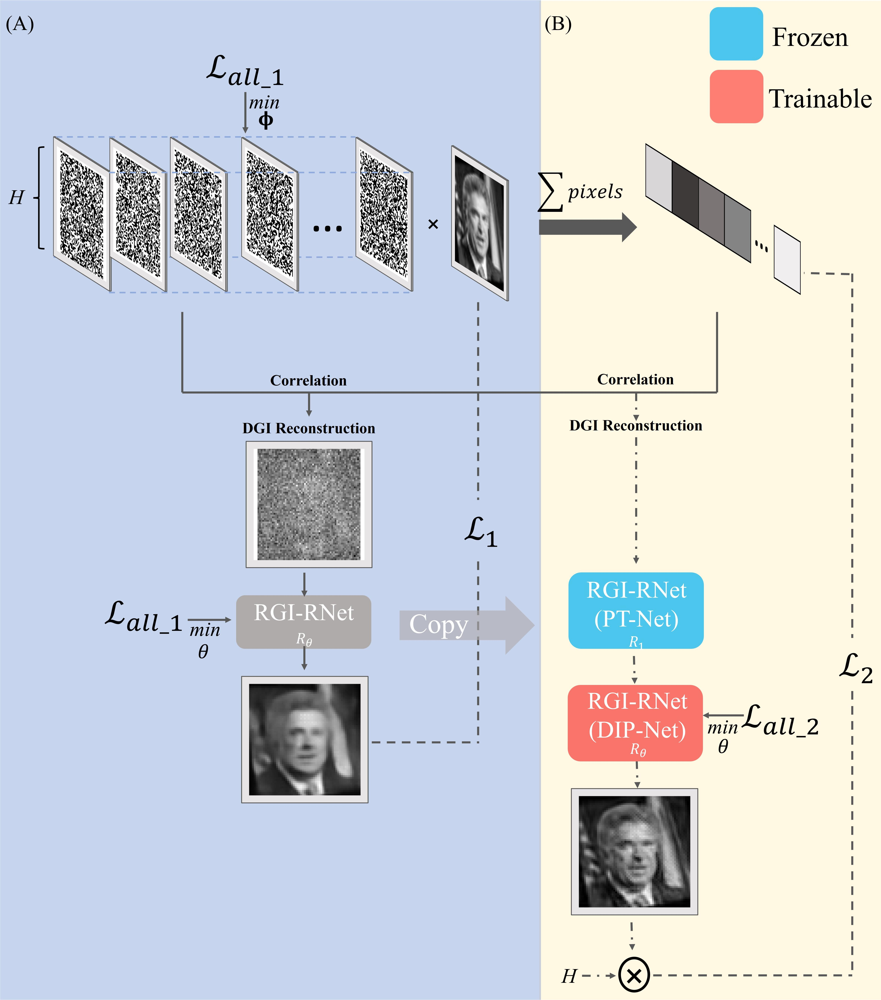
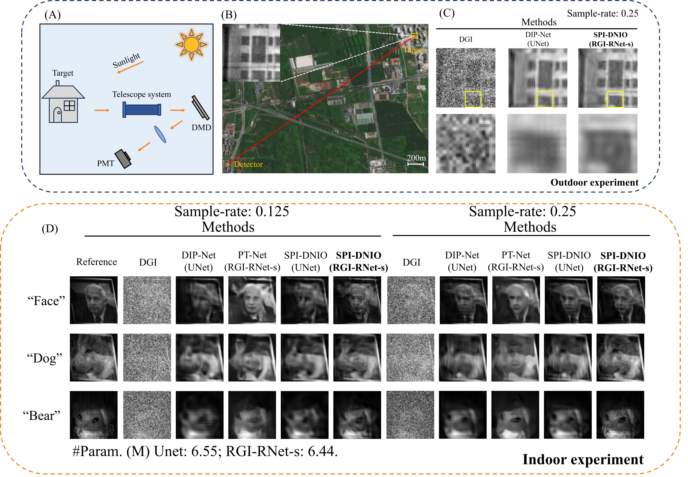

## 📌 SPI-DNIO
Pytorch implementation of the method in the paper: Single-pixel imaging via data-driven and deep image prior dual-network. The weights of RGI-RNet and the dataset utilized for training will be provided to reproduce the results in this paper. If you find this repo useful, please give it a star ⭐ and consider citing our paper in your research. Thank you.


## 📘 Overview
<p align="center">
  
</p>

## 🔬 Abstract

Single-pixel imaging (SPI), especially when integrated with deep neural networks like Deep Image Prior Networks (DIP-Net) or Data-Driven Networks (DD-Net), has gained considerable attention for its capability to generate high-quality reconstructed images, even in the presence of sub-sampling conditions. However, DIP-Net often requires thousands of iterations to achieve high-quality image reconstruction, and DD-Net performs optimally only when the target closely resembles the features present in its training set. To overcome these limitations, we propose a Dual-Network Iterative Optimization (SPI-DNIO) framework that combines the strengths of both DD-Net and DIP-Net. It has been demonstrated that this approach can recover high-quality images with fewer iteration steps. Furthermore, to address the challenge of SPI inputs having less effective information at low sampling rates, we have designed a residual block enriched with gradient information, which can convey details to deeper layers, thereby enhancing the deep network’s learning capabilities. We have applied these techniques to both indoor experiments with active lighting and outdoor long-range experiments with passive lighting. Our experimental results confirm the exceptional reconstruction capabilities and generalization performance of the SPI-DNIO framework.

## 📊 Results
<p align="center">
  
</p>

## 📁 Project Structure
    SPI-DNIO/
    ├── Archs.py # Network structure
    ├── Test.py # Method of SPI-DNIO
    ├── Util.py # Helper functions
    ├── Data/   # Test data 
    │   └── img.jpg
    ├── requirements.txt # The dependencies
    └── README.md


## 🚀 Getting Started

### Requirements

- Python 3.9
- einops 0.8.1
- numpy 1.21.5
- pandas 1.4.4
- Pillow 11.2.1
- pytorch_msssim 1.0.0
- torch 2.3.0+cu121
- tqdm 4.64.1

### Create Environment
   ```pip install -r requirements.txt```
### Prepare Dataset
Download the [LFW](https://pan.baidu.com/s/1OiFNSqYAUSgzayoTATbOiA) (code: ```4yiz```) utilized for training in our paper.
### Testing
Download our models and patterns from [Baidu Disk](https://pan.baidu.com/s/1q4MNzbIorGynaWXxZ3T2YQ) (code: ```yies```), set the paths in Test.py then run it.

##  📚 Citation

```shell
@article{Shi:25,
author = {Jing-Yi Shi and Jia-Qi Song and Peng-Cheng Ji and Zi-Qing Zhao and Yuan-Jing Yu and Ming-Fei Li and Ling-An Wu},
journal = {Opt. Express},
number = {12},
pages = {26690--26702},
publisher = {Optica Publishing Group},
title = {Single-pixel imaging via data-driven and deep image prior dual networks},
volume = {33},
month = {Jun},
year = {2025}
}
```

## 📄 License
For academic and non-commercial use only.
